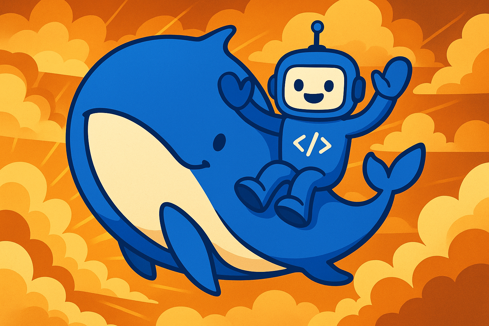

# WhaleRider

 
## Overview

This is an advanced autonomous agent system built with LangChain that can perform a variety of tasks to achieve a given objective. The agent can:

- Search the web
- Scrape web pages
- Read and write files
- Execute OS commands
- Perform mathematical calculations
- Run Python code
- Create documentation
- Generate and execute custom tools
- Maintain memory and state across sessions

The system includes a real-time monitoring dashboard for observing the agent's progress.

## Features

### Core Capabilities

- **Goal-oriented execution**: Breaks down objectives into manageable goals
- **Tool integration**: Comes with multiple built-in tools and can create custom ones based on the objective and the goal it is trying to achieve.
- **Memory persistence**: Maintains state across executions
- **Reflection and planning**: Analyzes progress and adjusts strategy
- **Human feedback integration**: Allows for human guidance during execution per iteration just type ok + enter if no feedback is needed

### Built-in Tools

1. Web Search (`web_search`)
2. Web Scraping (`web_scrape`)
3. File Operations (`file_operations`)
4. OS Commands (`run_os_command`)
5. Math Calculations (`math_calculation`)
6. Python Execution (`execute_python`)
7. System Information (`system_info`)
8. Directory Listing (`read_directory`)
9. Documentation Creation (`create_documentation`)

## Requirements

- Python 3.8+
- Required packages (install via `pip install -r requirements.txt`):
  ```
  langchain-core
  langchain-openai
  langchain-text-splitters
  duckduckgo-search
  httpx
  chromadb
  sentence-transformers
  python-dotenv
  pydantic
  ```
- Ollama installed ready to go if you want it to be completly local.
- Recommended model is `qwen2.5:14b` for okay GPUS like 4070 run more parameters as your gpu can handle you get better performance, but works wonders with 14b qwen2.

## Environment Setup

1. Create a `.env` file with the following variables:
   ```
   API_KEY="ollama"
   MODEL_SLUG="qwen2.5:14b"
   PROVIDER_BASE_URL="http://localhost:11434/v1"
   ```

## Usage

### Basic Execution

```bash
python agent.py --objective "Your objective here" [--max_iterations 5] [--verbose]
```

### Arguments

- `--objective`: The main objective for the agent (required)
- `--max_iterations`: Maximum number of iterations (default: 5)
- `--verbose`: Enable verbose output

### Example

```bash
python agent.py --objective "Research the latest AI trends and create a summary report" --max_iterations 10 --verbose
```

## Monitoring Dashboard

During execution, a real-time monitoring dashboard is available at:

```
http://localhost:7777/
```

The dashboard shows:

- Current objective and status
- Goal statistics
- Tool usage
- Human feedback
- Live logs

## File Structure

- `./workspace/`: Main working directory
  - `agent_memory.json`: Persistent memory storage
  - `docs/`: Documentation files
  - `logs/`: Execution logs
  - `checkpoints/`: Agent state snapshots

## Custom Tools

The agent can create custom tools on-the-fly based on the current needs. These tools are:

1. Stored in memory
2. Available for future use in the same session
3. Documented in the agent's memory

## Error Handling

The system includes comprehensive error handling:

- Tool execution errors are caught and logged
- Failed goals are marked and reflected upon
- Checkpoints allow for recovery from failures

## Best Practices

1. **Clear Objectives**: Provide specific, measurable objectives
2. **Iterative Approach**: Start with small max_iterations and increase as needed
3. **Monitor Progress**: Use the dashboard to track execution
4. **Provide Feedback**: Use the human feedback prompts to guide the agent
5. **Review Documentation**: Check the `./workspace/docs/` directory for outputs

## Limitations

1. Web tools are rate-limited
2. OS commands are restricted to the workspace directory
3. Python execution has a 10-second timeout
4. Custom tools are session-persistent but not saved between runs

## Troubleshooting

1. **API Errors**: Verify your API keys and base URLs
2. **File Permission Issues**: Ensure the workspace directory is writable
3. **Tool Failures**: Check logs for specific error messages
4. **Memory Issues**: The system maintains a memory file - delete it to start fresh

## Development

To extend or modify the agent:

1. Add new tools by creating new functions and registering them in `_load_base_tools()`
2. Modify the goal processing logic in `process_goals()`
3. Enhance the monitoring dashboard in `start_monitoring_dashboard()`

## License

This project is open-source under the MIT License.
